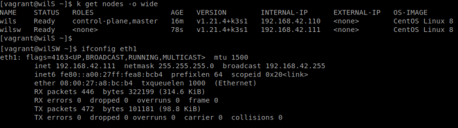
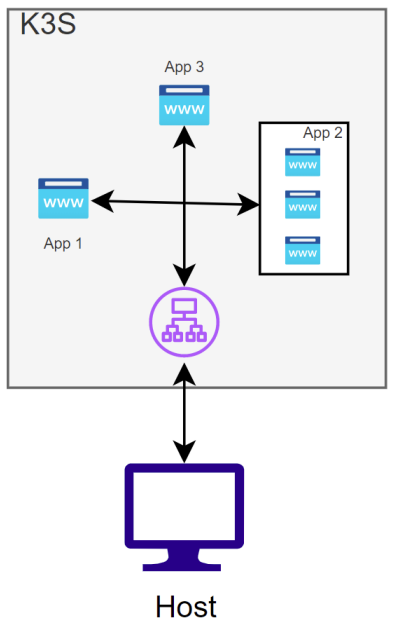
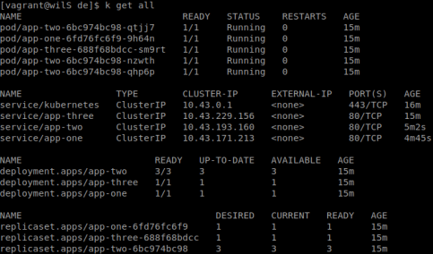
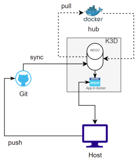
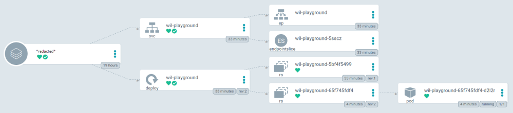

# Inception of things

# Introduction
### K8s - Kubernetes
Kubernetes, also known as K8s, is _an open-source system for automating deployment, scaling, and management of containerized applications_. 
### K3s - Lightweight Kubernetes
Lightweight Kubernetes. Easy to install, half the memory, all in a binary of less than 100 MB

## Part 1
Setup 2 virtual machines with Vagrant and configure K3s on both machines.
- In the first one (Server), k3s will be installed in controller mode.
- In the second one (ServerWorker), k3s will be installed in agent mode.
- Here is an example of the expected output

## Part 2
Setup 3 web application that will run in a K3s instance  

- When a client inputs the ip 192.168.42.110 in his web browser with the HOST app1.com, the server must display the app1. When the HOST app2.com is used, the server must display the app2. Otherwise, the app3 will be selected by default.  

## Part 3
Setup a _continuous integration_ following this infrastructure  

- Create two namespaces:
	- The first one will be dedicated to Argo CD.
	- The second one will be named dev and will contain an application. This application will be automatically deployed by Argo CD using your online Github repository
- The application that will be deployed must have two different versions.
	- v1
	- v2
	- You can find Wil’s application on Dockerhub here: https://hub.docker.com/r/wil42/playground. The application uses the port 8888.
- Here is an example of what is expected in the ArgoCD UI

## Bonus
Add Gitlab in the lab in Part 3
- Your Gitlab instance must run locally.
- Configure Gitlab to make it work with your cluster
- Create a dedicated namespace named gitlab.
- Everything you did in Part 3 must work with your local Gitlab.
